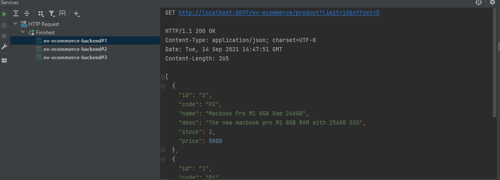
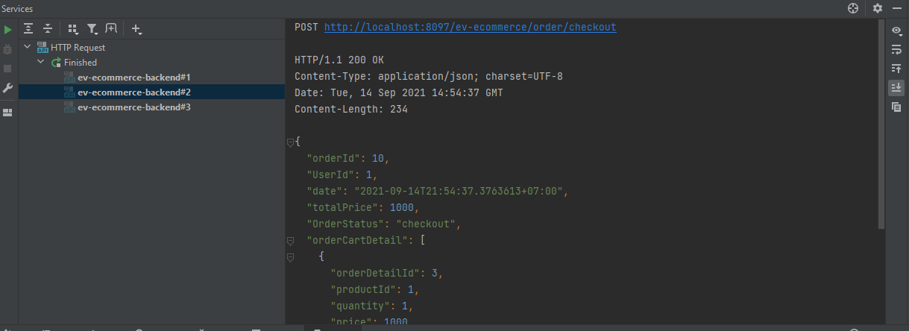
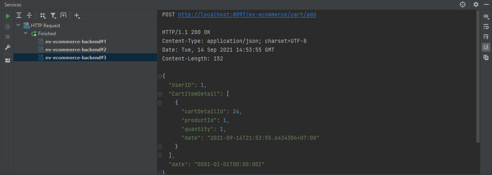
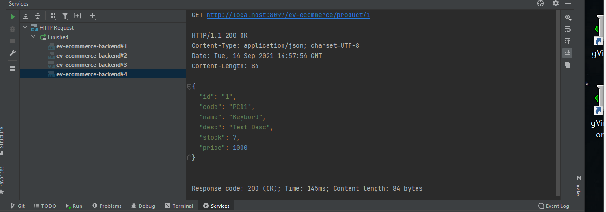

# ev-ecommerce-backend

#Problem
Let's take one case at a time. It's a one-day sale. They have a limited supply, yet thousands, if not millions, of people want to buy something.  Imagine if a million individuals hit the checkout button at the same time, and the stock management is abysmal. What is going to happen? Yes, a stock with a negative value. So, what is the root of the problem? There are several causes for this.

- Because of the race condition, the value of the variable changed. A race condition happens when multiple threads/processes attempt to modify the same data at the same time. For example, suppose you save the stock price in a variable and then numerous goroutines alter it at the same time. The stock value is then entered into a database. For example implementation see this repo [here](https://github.com/dedensmkn4/utama-real-estate)
- Database transactions are not used. Consider what would happen if an error occurred in the middle of adding orders and updating stock. If we aren't utilizing a transaction, how can we cancel the query? You can read more, [here](https://www.postgresql.org/docs/9.1/explicit-locking.html)
- Row locking isn't used in this transaction. This advanced issue occurs only when two or more requests arrive at the same time. You may find out more by clicking [here](https://www.postgresql.org/docs/9.1/explicit-locking.html).
- Poor Inventory Management, no realtime notification of remaining stock

#Implementation
###How To Run
- Copy paste .env.sample to .env. 
- import db in `database\ecommerce_poc_db.sql`
- Run Project `go run .\cmd\ev-ecommerce-backend\main.go`

##Clean architecture. [See](https://github.com/golang-standards/project-layout)
##Row Locking Transaction. [See](./internal/app/adapter/postgresrepository/product.go)
##DB Transactions included. [See](./internal/app/domain/usecase/order_cart.go)
##-Stock checking in [See](./assets/img_4.png)

API Docs : [See](./api/rest-client/ev-ecommerce-backend.http)

